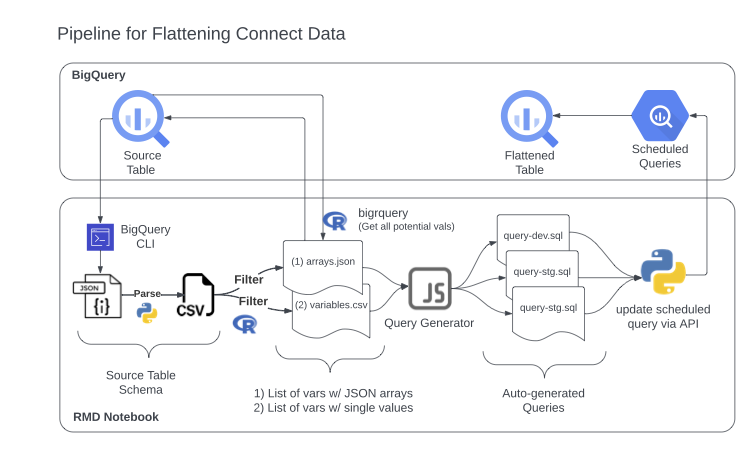

# flatteningRequests

A place to communicate about the team flattened data needs.

Use the *issues* tools to make and manage requests.

## Diagram of automated flattening pipeline
```mermaid
flowchart LR
    subgraph BQ [BigQuery]
        SRC[[Source Table]]:::table
        QUERY(Scheduled Query):::table
        FLAT[[Flattened Table]]:::table
    end
    class BQ subgraphTitle;

    SCH[/schema.json/]:::file
    DEV[/dev.sql/]:::file
    STG[/stg.sql/]:::file
    PROD[/prod.sql/]:::file

    subgraph LOC ["flatten.Rmd"]
        FETCH("fetch_schema()"):::function
        SCH_CSV[/"schema.csv"/]:::file
        FILT("filter_vars()"):::function
        ARR[/arrays.json/]:::file
        VAR[/variables.csv/]:::file
        GEN("generate_queries()"):::function
    end
    class LOC subgraphTitle;

    SRC --- |API| SCH:::link
    SCH --> FETCH:::link
    FETCH --> SCH_CSV:::link
    SCH_CSV --> FILT:::link
    FILT --> ARR:::link & VAR:::link
    ARR & VAR --> GEN:::link
    GEN --> DEV:::link & STG:::link & PROD:::link
    DEV & STG & PROD --> |API| QUERY:::link
    QUERY --> FLAT:::link

    classDef table link stroke:#000,stroke-width:1.5px;
    classDef schema fill:#ff9,stroke:#333,stroke-width:2px;
    classDef function fill:#ffc,stroke:#333,stroke-width:2px;
    classDef file fill:#cfc,stroke:#333,stroke-width:2px;
    classDef subgraphTitle font-size:24px;

```

## queryGenerators

These query generators and the associated input files were originally written by Warren Lu and are now maintained by Jake Peters.

The *queryGenerators* directory contains sub-directories for each scheduled query. Each folder contains the files required to generate a query. For instance, M2 contains the following files:

-   ***M2QueryGenerator.js*** - A JavaScript program that generates queries.
-   ***M2-lists.js*** - A text file containing lists of variables that contain JSON arrays to be flattened.
-   ***M2-variables.txt*** - A text file containing lists of variables to be flattened.

The query generator uses the contents of the two text files to generate three text files containing queries:

-   ***flatM2_WL-dev.txt*** - A query for the dev environment.
-   ***flatM2_WL-stg.txt*** - A query for the stage environment.
-   ***flatM2_WL-prod.txt*** -A query for the dev environment.

To run the query generator, you must have [node.js](https://nodejs.dev/en/download/) installed. Once you have updated the *M2-lists.js* and *M2-variables.csv* files, navigate to the appropriate folder in terminal and run the query generator in the command line using the following command: `node M2QueryGenerator.js`.

### Current Workflow

When a member of the Analytics Team requests that new variables be added to a query, Jake adds them to one of the two input files and runs the query generator script in the command line to generate the queries. He then copies the queries from the text files and pastes them into the scheduled query in GCP and clicks *Update Query*.

### Goals:

Warren made our lives easier by writing query generators that reference these input files. This reduced the amount of manual effort. In the future, we would like to take this a step further and generate flattening queries that directly reference the table schema. See *towardAutomaticFlattening* folder for progress towards this.
