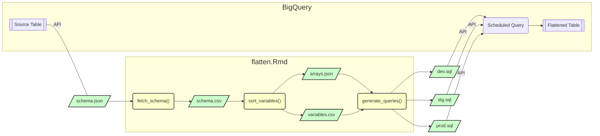

# flatteningRequests

A place to communicate about the team flattened data needs.

Use the *issues* tools to make and manage requests.

## The flattening workflow:


`flatten.Rmd` is an R notebook that simplifies the process of flattening the Connect4Cancer source tables:
1. Retrieve the schema of the source table using the BigQuery API.
2. Convert the schema from JSON to CSV.
3. Sort the variables in the source table by their data structure: arrays and non-array variables and stores them in appropriate files.
4. Generate SQL queries for each environment.
5. Update the Scheduled Query which generates the flattened table daily.

> **Notes:**
> - The user can ignore the `bash/`, `python/` and `js/` directories which store legacy code that could be referenced later.
> - The core functions of this workflow are in teh `r/` directory

## Query configurations
The `query_configs/` directory stores a metadata for each table to be flattened and is referenced by the `flatten.Rmd` notebook. To set up a new table for flattening, a new config folder needs to be setup for the new table with meta data about the table. 

Here is an example:

```

```
